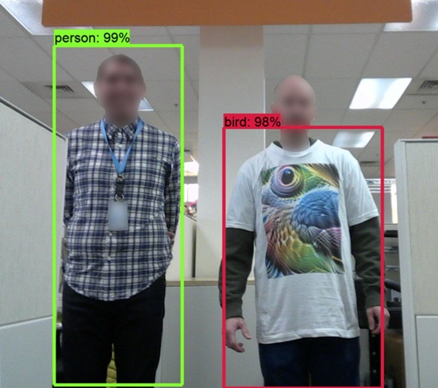
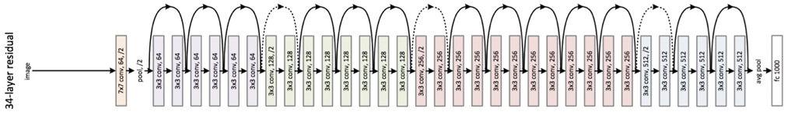
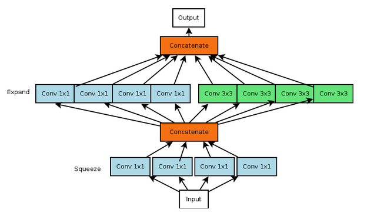
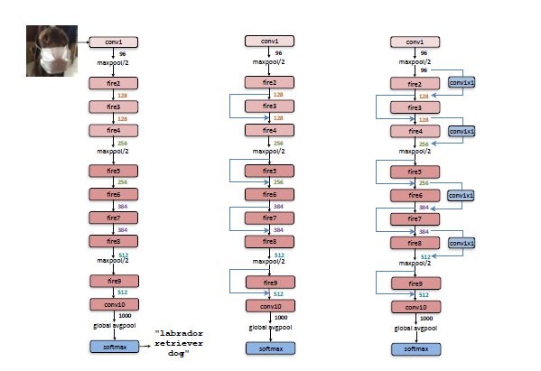
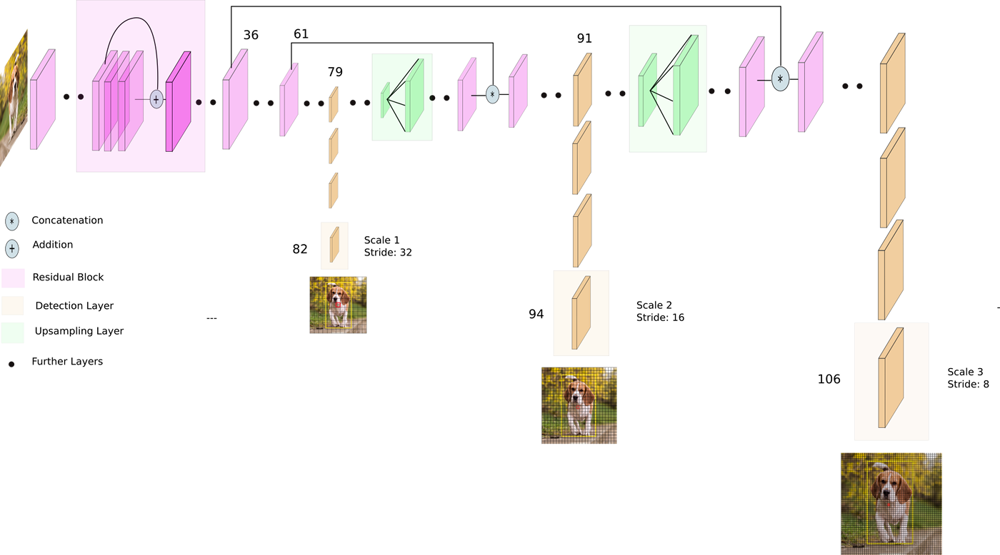

# PES University -- Intel India Technovation Contest 2020
## 2nd Edition, Jan to May 2020
## CIE in collaboration with Department of CS and ECE

## Problem Statement
The purpose of the activity would be to enhance the vision of the driver with other sensors or smarter algorithms that can work in low light scenarios – dusk, night, in lights from headlights, etc.  
The solution would be able to detect common objects like cars, two-wheelers, auto-rickshaws, pedestrians, riders in the night/low-light conditions. The system can be developed to work in the visible spectrum, infra-red, or ultra-sound. 
Target performance for an ideal scenario would have the algorithm running at 30Hz.

## Object Detection: An Overview
Object Detection, localizing objects in image frames, has been the focus of the Deep Learning, and Computer vision fraternity for decades now.  It plays a crucial role in the autonomous industry and the algorithms here can be used for Image classification, which indeed can be used almost everywhere.  
The major problem faced during Object Detection using state of the art models is the data available works well for the test images but ground truth images can have outliers and the image context can change which can adversely affect the output. 
Here are a few examples where the object detection algorithm fails: 
 
If you are using object detection algorithm or even using any segmentation model in autonomous car and a person wearing such an adversial t-shirt, it could cause a crash. 
 
Misunderstanding the traffic signboard on the road could result in a ticket for a semi-automated/automated car which is not a desirable feature. 
The generalization of object detectors is the key to the success of the autonomous industry and in this project. Here, in this project, we try to make the object detection in low light conditions/ twilight and propose a network that could help in the generalization of object detectors.

## Previous Works
### VGG-16
VGG16 also known as <b>OxfordNet</b>, is a convolutional neural network(CNN) model. This model was presented by Simonyan and Zisserman in their paper "Very Deep Convolutional Networks for Large Scale Image Recognition". The 16 in the VGG16 stands for the 16 layers, which contain weights. This model can achieve 92.7% top-5 test accuracy in <b>ImageNet</b>, that is a dataset of more than 14 million images which approximately contains more than 20,000 categories and belongs to 1000 classes. The dataset, ImageNet comprises of images with varying-resolution, hence the images need to be down-sampled to a specific-resolution of 256x256.  Here's the architecture of VGG16 model. 
 
A distinctive quality of VGG16 is that it doesn't have a large number of hyper-parameters, hence making a refinement over AlexNet. Instead it has convolution layers of 3x3 filter with a stride 1 where the padding used was same, along with the maxpool layer of 2x2 filter of stride 2. 
 
The input to the network is an image of dimensions 224x224 RGB image(i.e. 224x224x3). Afterwards the image is being passed through a series of convolutional layers where the filters have a size of 3x3 also having the same padding. A padding of 1-pixel (same padding) is done after each convolution layer to prevent the spatial feature of the image. After passing the images through a series of convolutional layers and max-pooling layer, we get a 7x7x512 dimension feature map, which is in-turn flattened to obtain another feature map of dimension 1x25088. Henceforth we get 3 fully connnected layers, where first and second layers take the input from the last feature vector and subsequently outputs a vector of dimension 1x4096, and the third layer outputs 1000 channeels for 1000 classes. Lastly, the third layer is passed to softmax layer in order to normalize the classification vector. 
Nowadays it has been outmatched by more recent models such as Inception and ResNet.  
### R-CNN
R-CNN is short for “Region-based Convolutional Neural Networks”. The basic task of RCNN is to correctly identify the object present in an image via the bounding box. While detecting, the issue faced is that there is a huge number of regions within the image as the object of interest might have different spatial locations. 
R-CNN helps in identifying a manageable number of bounding-box object region using <i>selective search algorithm.</i> After this, the identified regions are wrapped and fed into CNN resulting in a vector output. It extracts CNN features from each region independently for classification using SVM to see what object the image in the box is. The box runs through a linear regression model to obtain a box with tighter coordinates once the classification of the object is done.  Along with predicting object within the region, the algorithm also predicts the offset values (x1 y1 x2 y2) to increase the precision of the bounding box and help in adjusting the bounding box of the region proposal. 
Here's the architecture of R-CNN:  
 

### ResNet
The ResNet that stands for "Residual Neural Network" is an Artificial Neural Network that alleviates the problems present with the Deep Network. This is done by implementing a new neural network layer - <b>The Residual Block.</b>  Following is the image representing Residual Block: a building block. 
 
ResNet solves many problems but one of the major issues solved with this was the <b>vanishing gradient</b> in the deep neural network which was caused due to very deep network and thus making them hard to train. This further results in the shrinking of the gradient and the weights not being updated. Hence, ResNet utilizes <i>skip connection</i> so that the gradient can directly be propagated backward from later layers to initial filters. 
In skip connection, the convolution layers are stacked one over the other, same way as before but now we also add the original input to the output of the later convolution block. 
The block or the residual block used in ResNet depends on whether or not the input is in dimension with the output. If the dimensions are same then <b>the identity block</b> is implemented. And, if the input/output dimensions don't match up with each other then <b>the convolutional block</b> is implemented. 
Here is the architecture of ResNet model that explains it in a better way. 
 
For best results, it is recommended that the activation function is applied after the skip connection. 
### DenseNet
DenseNet also known as Densely Connected Convolutional Network, is in a way a logical extension of ResNet. It is a network architecture in which each layer obtains additional inputs from all preceding layers and passes on its own feature-maps to all subsequent layers in a feed-forward fashion, hence improving the gradient propagation. For example, usually in a traditional convolutional network with L layers, will have L connections(one between each layer and its following layer). But here in this network there will be L(L+1)/2 direct connnections. Consequently, these network connections are performed using <b>Channel wise concatenation<b/>. 
 
Since the network's each layer receive feature map from all of the previous layers, the network can be more <b>compact and thinner<b/>, which means that roughly the number of channels will be less. Hence increasing the memory and computational efficiency. DenseNet Architecture comprises of basic DenseNet composition layer. For each composition layer, Batch Norm (BN) and ReLU, and then 3×3 Conv are done with output feature maps of k channels to transform x0, x1, x2, x3 to x4. 
The number of parameters in DenseNet is directly proportional to l×k×k, therefore DenseNet has much smaller size than ResNet, whose number of parameters are C×C.
### Squeezenet
Deep convolutional neural networks (CNNs) concentrate essentially on the improvement of accuracy.
There are multiple architectures of CNN that can achieve equivalent accuracy with compressed architectural design like SqueezeNet with the advantage of lower communication during distributed traning across the servers, lesser bandwidth to autonomous car from cloud and more easy to deploy on FPGA. It contains comperatively smaller no. of parameters and can achieve AlexNet kind of accuracy on Imagenet image classification dataset. Squeezenet is compatible in a computer memory with ease of transmission over a computer network. SqueezeNet is also extended  to other applications such as semantic segmentation of images.
By replacing conventional 3x3 filters with 1x1 convolutional filters, the network could be made smaller as 1x1 filters has less number of parametrs and also looks at only one pixel at one time. Fire Module are the building block that are used in SqueezeNet.
It comprises of squeeze layers that contains only 1x1 filters feeding to the expand layer of a mix of 1x1 and 3x3 convolution filters.The number of filters in expand layer must be more than the number of filters in squeeze layer.
 
 
It has a standalone convolution layer (conv1), that are followed by 8 Fire modules (fire2-9), ending with a final conv layer (conv10). The idea is to gradually increase the number of filters per fire module to the overall network. With a stride of 2 after layers conv1, fire4, fire8, and conv10, it performs max-pooling these relatively late placements of pooling are per the downsample late in the network so that convolution layers have large activation maps.
 
 
### MobileNet
### YOLOv3
"You Look Only Once" is yet another and one of the fastest algorithms for object detection which is of much use when we want to detect objects in real-time.   
A single neural network is applied to the complete image i.e., the image is divided into small regions by the network, and bounding boxes that are weighted by the predicted probabilities are calculated. In this, the CNN works with skip connections, residual blocks and as well as upsampling helping us in improvising the precision with which the detection is done. 
Talking about YOLOv3, it has a deeper architecture of feature extractor called Darknet-53 which has 53 convolutional layers(as mentioned in the name) followed by batch normalization layer and Leaky ReLU activation function. Following is the image showing Darknet-53 model and we can see that it doesn't contain any pooling layer for downsampling feature maps, instead convolutional layer with stride equal to 2 is used. 
 
How YOLO works is that an image is given as input and laters it split into a square grid say SxS, within each of the grid m bounding boxes, are taken. A class probability and offset values for each bounding box send as an output by the network and boxes are used to locate the object within the image having the class probability above a threshold value. Here is an architecture of YOLOv3 model. 
 

## Datasets
### COCO Dataset
The majority of the state of the art, modern object detection, and segmentation models are trained and tested on this Common Objects in Context Dataset, often referred to as the COCO dataset. For our problem statement, we need to detect Common Objects on roads like Car, Person, Motorcycle, Animals, Truck, Train, etc. that are available in this dataset. This dataset has a high number of images to the number of the class ratio that helps in training. The modern architectures trained on this dataset can detect the objects in low light conditions but only with deep architectures, also the complexity of the model architecture is high because of the higher number of redundant classes. 
### Indian Driving Dataset
### BDD Dataset

## Innovation Component
### Cycle-GANs

## Our Approach
### YOLO implementation
### Comparison of different Models

## Results
### Cycle GAN
### YOLO implementation
### Comparitive Study Results

## Credits
This project was completed by a team of students from PES University, Kashish Oberoi, Shobhit Tuli, Anuvrat Singhal, and Anushk Misra 
under the Guidance of Prof. Veena S., Department of ECE, PES University.

